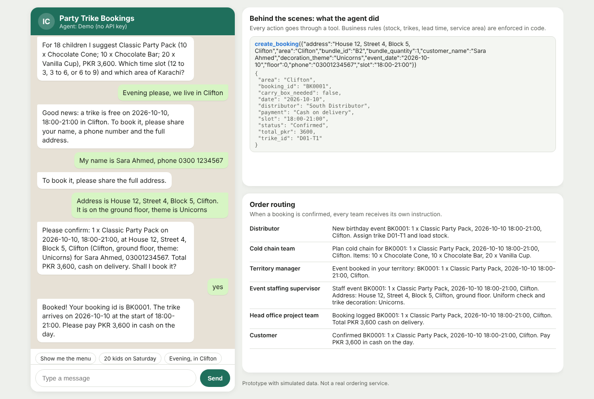
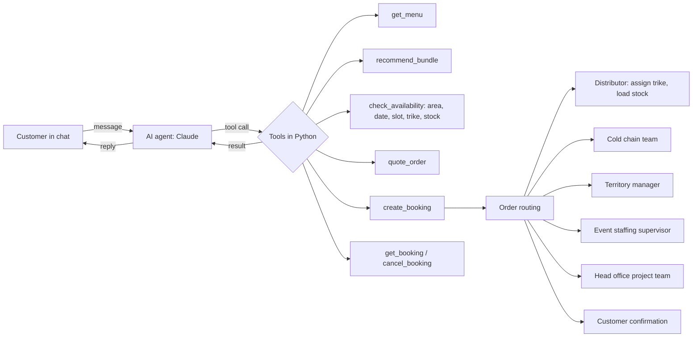
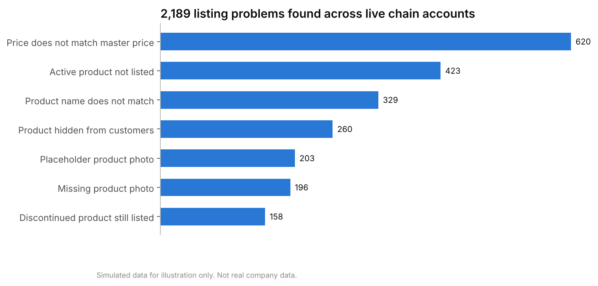
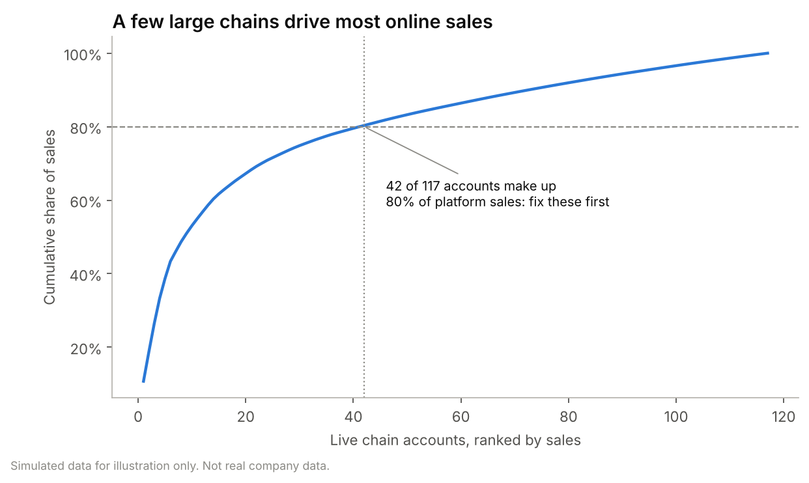
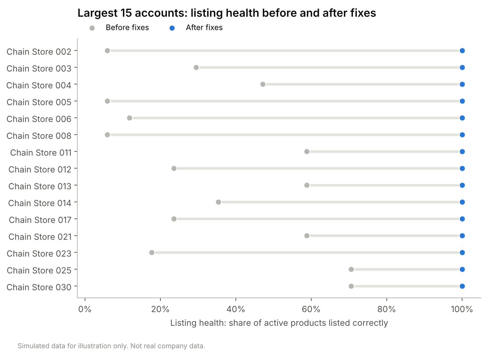
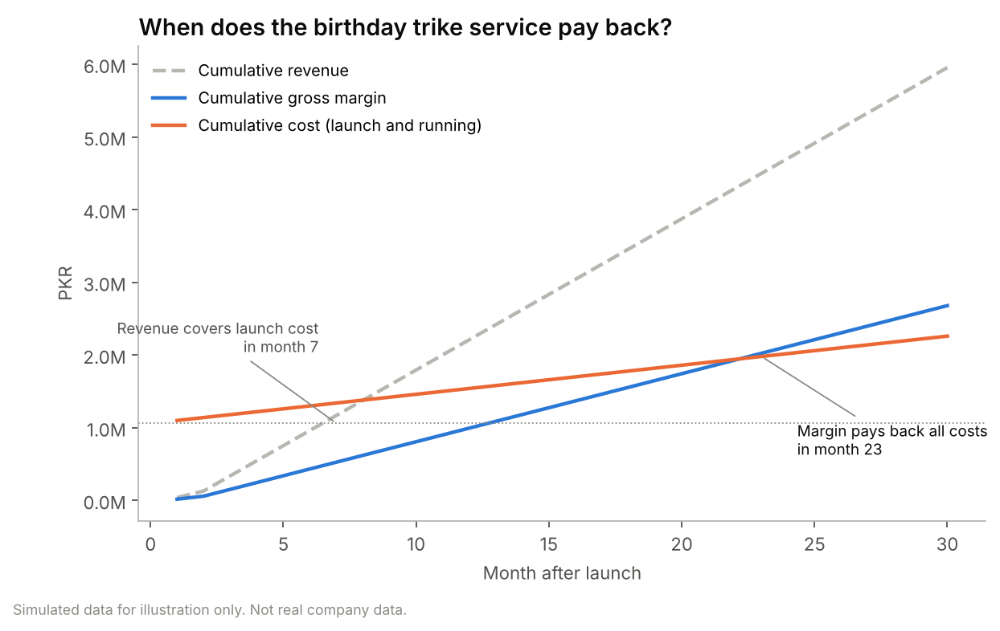

> **Disclaimer:** All data in this repository is simulated. It is used only to demonstrate the modelling approach and the work performed, and it is not real company data.

# Birthday Ordering AI Agent

**An AI agent that books ice cream trikes for birthday parties through chat, checks real constraints with tools, and routes every confirmed order to the teams that deliver it.**

Plus two companion tools from the same internship: a **listing quality checker** for chain stores on a quick commerce platform, and a **business case model** in Python and Excel.


[](https://github.com/mbaqirdilawari/birthday-ordering-ai-agent/actions/workflows/tests.yml)

> [!IMPORTANT]
> **All data in this repository is simulated.** Products, prices, distributors, stock, chain accounts, sales and costs are invented, and exist only to show how the system works.
> This is a **working prototype of a system I designed** during a 2022 summer internship in customer development at the ice cream division of a multinational in Pakistan. In the original pilot, the ordering flow ran manually through a chat based shop and partner teams. This repository turns that design into software. No company, agency, partner or platform names, and no real figures, are included.



---

## Contents

1. [The business idea](#1-the-business-idea)
2. [Part 1: the AI ordering agent](#2-part-1-the-ai-ordering-agent)
3. [Part 2: the listing quality checker](#3-part-2-the-listing-quality-checker)
4. [Part 3: the business case](#4-part-3-the-business-case)
5. [Lessons from the pilot, built into the code](#5-lessons-from-the-pilot-built-into-the-code)
6. [How to run it](#6-how-to-run-it)
7. [Repository structure](#7-repository-structure)
8. [Glossary](#8-glossary)

---

## 1. The business idea

Ice cream sellers ride **trikes** (tricycles with a freezer) through neighbourhoods. Two things were true at the same time:

* **Children's birthday parties were a growing occasion**, and families had already been calling to ask for a trike at their party.
* **Part of the trike fleet was under-used**, and trike sellers earned a modest fixed amount per day.

The idea: let families **book a decorated ice cream trike for a birthday party**, through a simple chat shop, with ready made party bundles and cash on delivery.

| Who | What they gain |
|---|---|
| Families | A fun, affordable party activity, booked in a few messages |
| Trike sellers | Extra earnings from a 3 hour event on top of their normal day |
| The brand | Free marketing in front of children and parents, sales of a profitable product mix, and idle trikes put to work |

The hard part is not the chat. It is everything behind it: the order must reach the **nearest distributor** with a **free trike** and **enough stock**, and the **cold chain team, territory manager, event staffing supervisor and head office** all need their own instructions. That is what the agent automates.

## 2. Part 1: the AI ordering agent

### What an "agent" means here

A chatbot only talks. An **agent decides what to do and takes actions** by calling tools. Here, Claude (an AI model) reads the customer's message, decides which tool it needs, Python runs the tool, and Claude uses the result to reply. This repeats until the booking is done.



### Why the rules live in code, not in the AI

The agent **cannot** book something impossible, because every rule is enforced in [`agent/ordering.py`](agent/ordering.py), not left to the AI model:

* **Service area:** the address must be in a served neighbourhood, within reach of a distributor.
* **Nearest distributor first:** the event is assigned to the closest distributor that has a free trike and enough stock (distance calculated from coordinates).
* **No double booking:** one trike per event per 3 hour slot.
* **Live stock:** stock is checked and reserved at booking, and released on cancellation.
* **Lead time:** at least one day of notice.
* **Confirmation:** the agent must show a summary and get a clear "yes" before calling `create_booking`.

### Two ways to run the agent

| Mode | When | How it decides |
|---|---|---|
| **Claude mode** | `ANTHROPIC_API_KEY` is set | Claude reads the conversation and chooses tools ([`agent/llm_agent.py`](agent/llm_agent.py)) |
| **Demo mode** | No API key | Simple rules read the message and call the same tools ([`agent/demo_agent.py`](agent/demo_agent.py)), so anyone can try it for free |

Both modes use exactly the same tools and rules. A full sample conversation, with every tool call and the order routing, is in [`outputs/transcripts/demo_conversation.md`](outputs/transcripts/demo_conversation.md).

### The web chat

`python app.py` starts a chat app styled like a messaging app. The right hand panel shows **what the agent did behind the scenes** (each tool call with its input and output) and **who received the order** once it is booked (screenshot at the top of this page).

## 3. Part 2: the listing quality checker

The second internship project was about selling through a **quick commerce platform** (an app that delivers groceries in minutes). Chain stores sold the brand's ice cream there, but their online listings were in poor shape, and customers cannot buy what they cannot see or trust.

[`omnichannel/audit.py`](omnichannel/audit.py) compares every listing against the **master catalog** (the single source of truth) and flags:

| Problem | Fix suggested |
|---|---|
| Price does not match the master price (more than 2 percent off) | Update the price |
| Active product not listed | Add the product |
| Product name does not match | Use the official name |
| Product hidden from customers | Make it visible |
| Placeholder or missing product photo | Upload the official photo |
| Discontinued product still listed | Remove the listing |

Then it **prioritizes**: a few large chains make most of the online sales, so the accounts that together make up **80 percent of platform sales are fixed first**. It also ranks chains that are **not yet on the platform**, to plan who to onboard next.

<p align="center">
  
  
</p>

| Result (simulated data) | Value |
|---|---|
| Live chain accounts checked | 117 |
| Listings checked | 1,724 |
| Problems found, each with a fix | 2,189 |
| Accounts to fix first (80 percent of sales) | 42 |
| Sales weighted listing health, before | 28 percent |
| Sales weighted listing health, after fixing the 42 accounts | 86 percent |



Outputs: an issue log with a fix for every problem ([`listing_issue_log.csv`](outputs/tables/listing_issue_log.csv)), an account scorecard ([`account_scorecard.csv`](outputs/tables/account_scorecard.csv)) and an onboarding priority list ([`onboarding_priority.csv`](outputs/tables/onboarding_priority.csv)).

## 4. Part 3: the business case

[`business_case/model.py`](business_case/model.py) answers: **when do the launch costs (social media, influencers, posters, trial events) pay back?** It does so in two ways, because they give very different answers:

| Method | Question | Answer (simulated) |
|---|---|---|
| **Revenue basis** (the quick method used in a pitch) | When has revenue matched the launch cost? | **Month 7** (408 orders) |
| **Margin basis** (stricter) | When does gross margin cover launch costs **and** monthly running costs? | **Month 23** |



The gap between the two is the honest point: on margin alone the service pays back slowly, so its case also rests on the **free marketing at every party** and the **extra earnings for trike sellers** (simulated: from PKR 900 to PKR 1,700 on an event day). A sensitivity table shows the payback month for different order levels and order values ([`business_case_sensitivity.csv`](outputs/tables/business_case_sensitivity.csv)).

The same model is in Excel with live formulas, for colleagues who do not code: [`excel/Birthday_Trike_Business_Case.xlsx`](excel/Birthday_Trike_Business_Case.xlsx). Change a blue input cell and everything recalculates. A test checks that Excel and Python give the same payback month and the same sensitivity table.

## 5. Lessons from the pilot, built into the code

The pilot ran mock orders before launch. Its lessons became rules in the software:

| Lesson from the pilot | How the code handles it |
|---|---|
| Stock shown in the shop did not always match real stock | Stock is checked live and reserved at booking |
| Trikes cannot reach upper floor apartments | The agent asks for the floor, and upper floor events tell the staffing supervisor to bring an insulated carry box |
| Every order had to reach several teams by hand | One booking automatically sends each team its own instruction |
| Event staff needed clear standards | The supervisor's message includes the uniform check and the decoration theme |

## 6. How to run it

Requires Python 3.10 or newer.

**Terminal** (one command at a time):

```bash
git clone https://github.com/mbaqirdilawari/birthday-ordering-ai-agent.git
cd birthday-ordering-ai-agent
python -m venv .venv
source .venv/bin/activate          # on Windows: .venv\Scripts\activate
pip install -r requirements.txt
python app.py                      # web chat at http://127.0.0.1:5000 (demo mode)
```

To use Claude instead of demo mode, set an API key first (**Terminal**):

```bash
export ANTHROPIC_API_KEY="your-key-here"     # on Windows: set ANTHROPIC_API_KEY=your-key-here
python app.py
```

Other commands (**Terminal**):

```bash
python run_chat.py      # chat in the terminal instead of the browser
python run_all.py       # rebuild all data, tables, charts, the Excel model and the sample transcript
python -m pytest        # run the 14 tests
```

## 7. Repository structure

```
birthday-ordering-ai-agent/
├── app.py                        # web chat (Flask)
├── run_chat.py                   # terminal chat
├── run_all.py                    # rebuild every output
├── agent/
│   ├── ordering.py               # tools and every business rule
│   ├── llm_agent.py              # Claude tool use loop
│   ├── demo_agent.py             # rule based demo mode (no API key)
│   └── web/index.html            # chat interface
├── omnichannel/audit.py          # listing quality checker
├── business_case/
│   ├── model.py                  # payback model and sensitivity
│   └── excel_model.py            # builds the Excel version
├── data/simulated/               # SIMULATED data only
├── excel/                        # Excel business case (live formulas)
├── outputs/                      # charts, tables, sample transcript (guide: outputs/README.md)
├── scripts/                      # data simulation, charts, transcript
└── tests/                        # 14 tests
```

## 8. Glossary

| Term | Meaning |
|---|---|
| **AI agent** | An AI model that decides which actions (tools) to take, not only what to say |
| **Tool use** | The AI model asks the program to run a function, then uses the result |
| **Trike** | A tricycle with a freezer, ridden by an ice cream seller |
| **Distributor** | The local business that stocks and runs the trikes in an area |
| **Cold chain** | Keeping ice cream frozen from storage to the customer |
| **Quick commerce** | Apps that deliver groceries within minutes |
| **Master catalog** | The official list of products, names, prices and photos |
| **Listing health** | Share of active products an account lists correctly |
| **Revenue basis / margin basis** | Payback measured with total sales, or with profit after product costs and running costs |

---

**Author:** Muhammad Baqir, MS in Interdisciplinary Data Science, Duke University.
